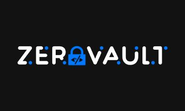

# ZeroVault – Offline Password & Email Subscription Tracker

**ZeroVault** is a privacy‑first, fully offline password manager and email subscription tracker built with Flutter.  
All your data stays on your device, locked behind your 6‑digit PIN. No cloud, no tracking, 100% privacy.

<p align="center">
  
</p>

[](https://github.com/Anzasu/ZeroVault/releases/latest)
[](LICENSE)

---

## Features

- **🔒 PIN‑protected vault** – secure your data with a 6‑digit PIN that never leaves your device.
- **🗄️ Local encrypted storage** – all passwords and notes are encrypted using AES‑256 before being written to the local SQLite database.
- **🔑 Secure key derivation** – the PIN is strengthened with PBKDF2 (100,000 rounds) and used to wrap the master encryption key.
- **📋 Credential management** – create, read, update, and delete login credentials (title, username/email, password, notes).
- **📧 Subscription tracking** – keep an eye on newsletters and recurring subscriptions (name, email, frequency: daily/weekly/monthly/yearly).
- **🔍 Search** – quickly find what you need.
- **📋 Clipboard copy** – tap to copy passwords or emails.
- **🌙 Dark theme** – consistent, eye‑friendly design.
- **⏱️ Auto‑lock** – the vault automatically locks after 10 minutes in the background.
- **🚫 Zero tracking, zero cloud** – no analytics, no network requests, your data stays with you.

---

## Download

Get the latest APK from the [**Releases**](https://github.com/Anzasu/ZeroVault/releases/latest) page.  
Install it directly on your Android device – no Play Store required.

*(iOS support coming in the future.)*

---
## Important: Please make sure to store your PIN in a secure space. Without it the app cannot be opened and all data is lost
---

## Security Design

1. **On first launch** a 256‑bit master encryption key is generated.
2. You create a 6‑digit PIN. A random 16‑byte salt is generated.
3. PBKDF2‑HMAC‑SHA256 (100,000 iterations) derives a key‑wrapping key from the PIN and salt.
4. The master key (plus a verification token) is encrypted with AES‑GCM and stored in platform‑secure storage (Android Keystore / iOS Keychain).
5. The raw PIN is **never stored** – only the salt and the encrypted blob.
6. On subsequent unlocks, the PIN is verified by decrypting the blob; the master key is recovered only in memory.
7. All sensitive vault fields are encrypted with AES‑256‑CBC (random IV per value) using the master key.

---

## Tech Stack

| Category               | Package(s)                                                                 |
|------------------------|----------------------------------------------------------------------------|
| Local database         | `sqflite`                                                                  |
| Secure secret storage  | `flutter_secure_storage`                                                   |
| PIN key wrapping       | `cryptography` (PBKDF2 + AES‑GCM)                                         |
| Vault data encryption  | `encrypt` (AES‑256‑CBC)                                                    |
| State management       | `provider`                                                                 |
| Navigation             | `go_router`                                                                |
| PIN input UI           | `pin_code_fields`                                                          |
| App theme persistence  | `shared_preferences`                                                       |
| Fonts                  | `google_fonts`                                                             |
| UI foundation          | Initial scaffold generated by FlutterFlow – heavily customised             |

---

## Getting Started

### Prerequisites

- Flutter SDK ≥ 3.0.0
- Android Studio / Xcode (for platform builds)

### Installation

```bash
git clone https://github.com/Anzasu/ZeroVault.git
cd ZeroVault
flutter pub get
```

### Run in debug mode

```bash
flutter run
```

### Build a release APK

1. Generate a keystore (if you haven't):
   ```bash
   keytool -genkey -v -keystore ~/upload-keystore.jks -keyalg RSA -keysize 2048 -validity 10000 -alias upload
   ```
2. Create `android/key.properties` with your signing info (see [Android signing docs](https://docs.flutter.dev/deployment/android#signing-the-app)).
3. Build:
   ```bash
   flutter build apk --release
   ```
   The APK will be at `build/app/outputs/flutter-apk/app-release.apk`.

---

## Contributing

Contributions, issues, and feature requests are welcome.  
Please open an issue before submitting a pull request to discuss the change.

By contributing, you agree that your code will be licensed under the [MIT License](LICENSE).

---

## License

This project is licensed under the [MIT License](LICENSE).

---

**ZeroVault** – your data, your device, your control.
```
